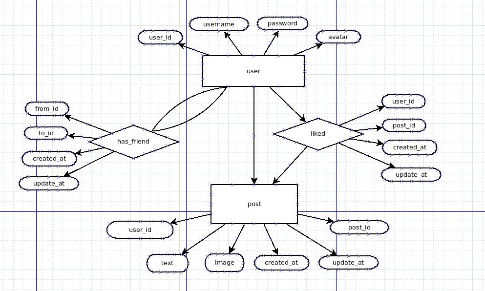

## freechat api service
---

## build environment
```
node: v8.11.3
npm: v5.6.0
```

## build database
```
cd database
docker-compose up -d

connect database in terminal:
mysql -uroot --protocol=TCP --port=3306 -p
```

## url

http://119.29.204.118:3000

## api table

|type| method|path|body|meaning|
|:-:|:-:|:-:|:-:|:-:|
|auth|POST|/auth|{"username":"test",<br>"password":"admin"}|登录(返回基本信息)|
|user|GET|/user||获取user表所有信息(without password)|
|user|GET|/user?user_id=1||获取指定id的user信息|
|user|GET|/user?username=ct||获取指定username的user信息|
|user|POST|/user|{"username":"test",<br>"password":"admin",<br>"avatar":"012301230123"}|新建用户|
|user|PUT|/user|{"username":"test",<br>"password":"admin",<br>"avatar":"012301230123"}|更新用户用户信息<br>(除了username不能更改，其余进行替换)|
|user|DELETE|/user?username=test||删除用户|
|has_friend|POST|/has_friend|{"from_id":18,<br>"to_id":21}|交友|
|has_friend|DELETE|/has_friend?from_id=14&to_id=12||绝交|
|post|POST|/post|{"user_id":18,<br>"text":"first post",<br>"image":"1221212121212"}|发动态|
|post|GET|/post?user_id=3||查看已关注的用户动态|
|post|DELETE|/post?post_id=1||删除自己的动态|
|liked|POST|/liked|{"user_id":18,<br>"post_id":3}|点赞(只能赞自己关注的用户)|
|liked|DELETE|/liked?user_id=1&post_id=2||取消点赞|
|comment|POST|/comment|{"user_id":18,<br>"post_id":3,<br>"content":"123"}|评论(只能评论自己关注的用户)|
|comment|DELETE|/comment?user_id=1&post_id=2||删除评论|
|综合|GET|/post/home||获取自己以及关注的用户的动态，包括动态的评论和点赞情况|
|综合|GET|/post/self||获取自己的动态，包括动态的评论和点赞情况|
|综合|GET|/user/count||获取个人动态数量，个人粉丝数量，关注用户数量，已发送的评论数量|

## table description

```
user
+----------+---------------+------+-----+---------+----------------+
| Field    | Type          | Null | Key | Default | Extra          |
+----------+---------------+------+-----+---------+----------------+
| user_id  | int(11)       | NO   | PRI | NULL    | auto_increment |
| username | char(50)      | NO   | UNI | NULL    |                |
| password | char(50)      | NO   |     | NULL    |                |
| avatar   | varchar(1000) | YES  |     | NULL    |                |
+----------+---------------+------+-----+---------+----------------+

post
+------------+---------------+------+-----+---------+----------------+
| Field      | Type          | Null | Key | Default | Extra          |
+------------+---------------+------+-----+---------+----------------+
| post_id    | int(11)       | NO   | PRI | NULL    | auto_increment |
| text       | varchar(1000) | YES  |     | NULL    |                |
| image      | varchar(5000) | YES  |     | NULL    |                |
| created_at | char(20)      | YES  |     | NULL    |                |
| updated_at | char(20)      | YES  |     | NULL    |                |
| user_id    | int(11)       | NO   | MUL | NULL    |                |
+------------+---------------+------+-----+---------+----------------+

has_friend
+------------+----------+------+-----+---------+-------+
| Field      | Type     | Null | Key | Default | Extra |
+------------+----------+------+-----+---------+-------+
| from_id    | int(11)  | NO   | PRI | NULL    |       |
| to_id      | int(11)  | NO   | PRI | NULL    |       |
| created_at | char(20) | YES  |     | NULL    |       |
| updated_at | char(20) | YES  |     | NULL    |       |
+------------+----------+------+-----+---------+-------+

liked 
+------------+----------+------+-----+---------+-------+
| Field      | Type     | Null | Key | Default | Extra |
+------------+----------+------+-----+---------+-------+
| user_id    | int(11)  | NO   | PRI | NULL    |       |
| post_id    | int(11)  | NO   | PRI | NULL    |       |
| created_at | char(20) | YES  |     | NULL    |       |
| updated_at | char(20) | YES  |     | NULL    |       |
+------------+----------+------+-----+---------+-------+

comment
+------------+---------------+------+-----+---------+-------+
| Field      | Type          | Null | Key | Default | Extra |
+------------+---------------+------+-----+---------+-------+
| user_id    | int(11)       | NO   | MUL | NULL    |       |
| post_id    | int(11)       | NO   | MUL | NULL    |       |
| created_at | char(20)      | YES  |     | NULL    |       |
| updated_at | char(20)      | YES  |     | NULL    |       |
| content    | varchar(1000) | YES  |     | NULL    |       |
+------------+---------------+------+-----+---------+-------+

session
+------------+----------+------+-----+---------+-------+
| Field      | Type     | Null | Key | Default | Extra |
+------------+----------+------+-----+---------+-------+
| user_id    | int(11)  | NO   | PRI | NULL    |       |
| value      | int(11)  | YES  |     | 0       |       |
| created_at | char(20) | YES  |     | NULL    |       |
| updated_at | char(20) | YES  |     | NULL    |       |
+------------+----------+------+-----+---------+-------+

```

## diagram

