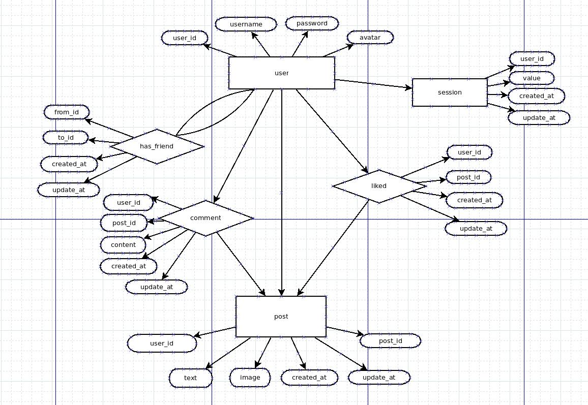

## freechat api service
---

## description

- Node+Koa2+Mysql
- 通过cookie+session记录用户的状态。
- 使用koa-restql将restful的url直接映射到数据库，提供一些基础的增删改查api。再通过权限中间件进行访问控制以及根据需求定制的接口提供完整的API服务。

## build environment
```
node: v8.11.3
npm: v5.6.0
docker: 18.06.1-ce
docker-compose: 1.23.2
```

## build database
为了方便，使用了mysql的docker镜像,当然也可以部署在本地
```
cd database
docker-compose up -d

connect database in terminal:
mysql -uroot --protocol=TCP --port=3306 -p
```

## url

http://119.29.204.118:3000

## api table

|type| method|path|body|meaning|
|:-:|:-:|:-:|:-:|:-:|
|auth|POST|/auth|{"username":"test",<br>"password":"admin"}|登录(返回基本信息)|
|user|GET|/user||获取user表所有信息(without password)|
|user|GET|/user?user_id=1||获取指定id的user信息|
|user|GET|/user?username%5B%24like%5D=%25ct%25||获取模糊匹配username的user信息|
|user|GET|/user/follower||获取所有粉丝信息|
|user|GET|/user/following||获取所有的关注用户|
|user|POST|/user|{"username":"test",<br>"password":"admin",<br>"avatar":"012301230123"}|新建用户|
|user|PUT|/user|{"username":"test",<br>"password":"admin",<br>"avatar":"012301230123"}|更新用户用户信息<br>(除了username不能更改，其余进行替换)|
|user|DELETE|/user?username=test||删除用户|
|has_friend|POST|/has_friend|{"from_id":18,<br>"to_id":21}|交友|
|has_friend|DELETE|/has_friend?from_id=14&to_id=12||绝交|
|post|POST|/post|{"user_id":18,<br>"text":"first post",<br>"image":"1221212121212"}|发动态|
|post|GET|/post?user_id=3||查看已关注的用户动态|
|post|DELETE|/post?post_id=1||删除自己的动态|
|liked|POST|/liked|{"user_id":18,<br>"post_id":3}|点赞(只能赞自己关注的用户)|
|liked|DELETE|/liked?user_id=1&post_id=2||取消点赞|
|comment|POST|/comment|{"user_id":18,<br>"post_id":3,<br>"content":"123"}|评论(只能评论自己关注的用户)|
|comment|DELETE|/comment?user_id=1&post_id=2||删除评论|
|综合|GET|/post/home||获取自己以及关注的用户的动态，包括动态的评论和点赞情况|
|综合|GET|/post/self||获取自己的动态，包括动态的评论和点赞情况|
|综合|GET|/user/count||获取个人动态数量，个人粉丝数量，关注用户数量，已发送的评论数量|

## diagram

